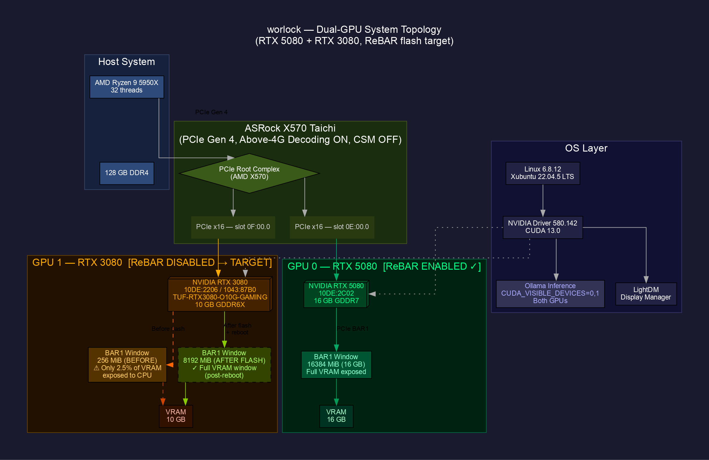
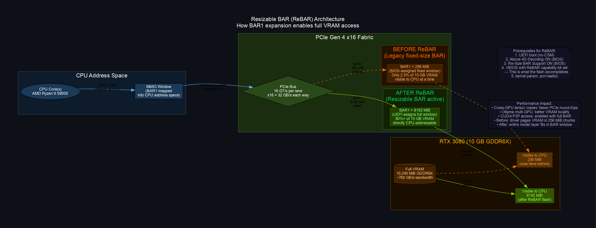
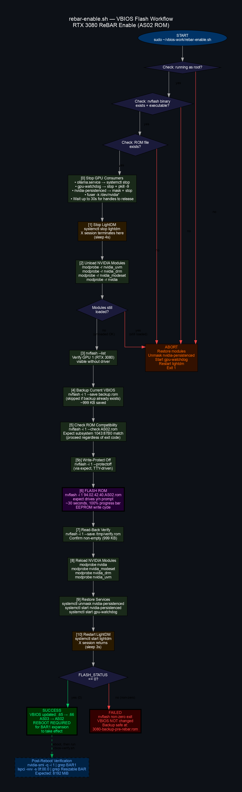
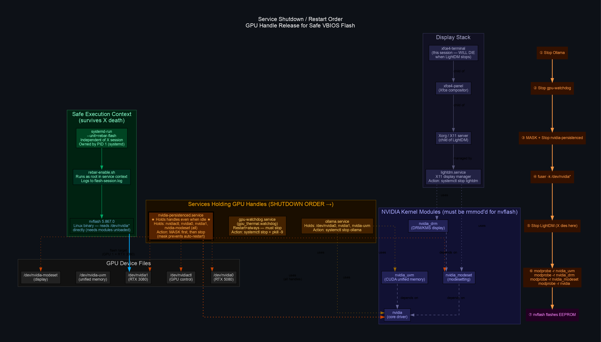
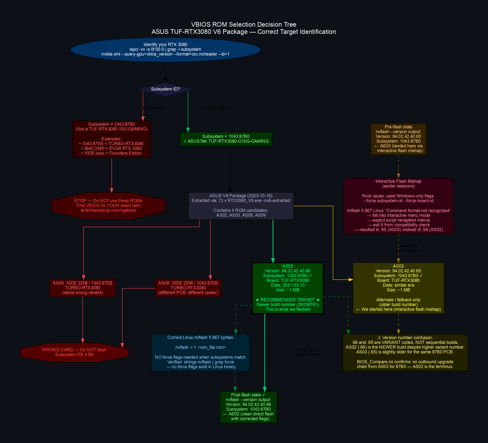

# RTX 3080 ReBAR VBIOS Flash — Linux

> Enabling Resizable BAR (8 GB BAR1) on an ASUS TUF-RTX3080-O10G-GAMING under Linux,
> without Windows, without a GUI flash tool, and without bricking the card.

## Table of Contents

- [Background](#background)
- [System](#system)
- [What Is Resizable BAR and Why Does It Matter?](#what-is-resizable-bar-and-why-does-it-matter)
- [Prerequisites](#prerequisites)
- [Scripts](#scripts)
- [How the Flash Works](#how-the-flash-works)
- [ROM Selection](#rom-selection)
- [Lessons Learned — What Went Wrong First](#lessons-learned--what-went-wrong-first)
- [Flash Results](#flash-results)
- [Post-Flash Steps](#post-flash-steps)
- [Recovery Plan](#recovery-plan)
- [Diagrams](#diagrams)
- [File Inventory](#file-inventory)
- [Analysis: ReBAR Speedup Model](analysis/rebar-speedup-model.md)

---

## Background

This repo documents a multi-attempt Linux VBIOS flash campaign to enable Resizable BAR
on an ASUS TUF RTX 3080 10 GB card in a dual-GPU system that also contains an RTX 5080.
The RTX 5080 had ReBAR active out of the box; the 3080 did not because its factory VBIOS
lacked the ReBAR capability bit.

ASUS ships VBIOS updates as Windows `.exe` self-installers. This project extracts the ROM
from inside the installer and flashes it directly via the Linux build of `nvflash`, handling
all the complications that come with doing this on a live X11 desktop without a spare
recovery machine.

**End result:** VBIOS updated from `94.02.42.40.65` (AS03) to `94.02.42.40.66` (AS02),
flash exit code 0, reboot pending for BAR1 expansion.

---

## System

| Component | Detail |
|-----------|--------|
| Machine | worlock |
| OS | Xubuntu 22.04.5 LTS, Linux 6.8.12 |
| Motherboard | ASRock X570 Taichi |
| CPU | AMD Ryzen 9 5950X (32 threads) |
| RAM | 128 GB DDR4 |
| GPU 0 | RTX 5080 — PCIe `0E:00.0` — 16 GB — ReBAR **ENABLED** (control) |
| GPU 1 | RTX 3080 — PCIe `0F:00.0` — 10 GB GDDR6X — ReBAR **target** |
| 3080 Subsystem | `10DE:2206 / 1043:87B0` (TUF-RTX3080-O10G-GAMING) |
| Display | Connected to GPU 1 (RTX 3080, `Disp.A: On`) |
| Driver | NVIDIA 580.142 / CUDA 13.0 |
| Display Manager | LightDM (Xfce default) |
| Inference | Ollama — both GPUs, `CUDA_VISIBLE_DEVICES=0,1` |
| nvflash | 5.867.0 (Linux x64 binary) |
| Target ROM | `94.02.42.40.AS02.rom` (V6 package, 2023-10-18) |

---

## What Is Resizable BAR and Why Does It Matter?

PCIe devices expose their memory to the CPU through fixed-size windows called Base Address
Registers (BARs). GPU BAR1 is the window through which the CPU can directly read and write
VRAM. Traditionally, BIOS firmware assigned this window at a fixed 256 MiB regardless of
how much VRAM the GPU actually has — a legacy of 32-bit address space constraints.

**Resizable BAR** (also marketed as AMD Smart Access Memory / SAM) is a PCIe feature that
allows the BIOS to negotiate a BAR1 window as large as the GPU's full VRAM. On a 10 GB
RTX 3080, a working ReBAR implementation expands BAR1 from 256 MiB to 8192 MiB.

### Why 8192 MiB, not 10240 MiB?

PCIe BAR sizes must be powers of two. 8 GiB is the largest power-of-two that fits within
10 GB, so that is what the BIOS assigns. The remaining ~2 GB of VRAM is still accessible
by the GPU internally; only the CPU-visible window is bounded by the BAR.

### Performance implications for multi-GPU inference (Ollama)

When Ollama loads a model across two GPUs (RTX 5080 + RTX 3080), the runtime may need to
move activations, KV-cache entries, and layer state across the PCIe fabric.

ReBAR expands the CPU-addressable window into VRAM from 256 MiB to 8192 MiB, reducing
remapping pressure for large transfers. It is not equivalent to CUDA Peer-to-Peer access,
which is a separate runtime capability gated on topology, NVLink/PCIe connectivity, and
driver negotiation:

    cudaDeviceCanAccessPeer(&canAccess, deviceA, deviceB);

ReBAR improves the memory-mapping situation. It does not, by itself, guarantee CUDA P2P.

---

## Prerequisites

### Motherboard BIOS (do this first)

These settings must be active before any VBIOS flash will have visible effect:

1. **Above 4G Decoding** → Enabled  
   *(ASRock X570 Taichi: Advanced → AMD CBS → NBIO Common Options → SMU Common Options)*
2. **Re-Size BAR Support** → Enabled  
   *(same submenu; may also appear as "SAM" or "Smart Access Memory")*
3. **CSM (Compatibility Support Module)** → Disabled  
   *(Boot → CSM → Disabled — ReBAR is a UEFI feature; CSM silently breaks it)*

Verify the 5080 (which has ReBAR natively) is already showing a large BAR1 to confirm
these settings are active before proceeding:

```bash
sudo lspci -vvv -s 0e:00.0 | grep -A5 "Resizable BAR"
# Expected: BAR 1: supported: 64MB 128MB ... 16GB
```

### Kernel parameter

```bash
# Check if pci=realloc is active
cat /proc/cmdline | grep -o 'pci=realloc'

# Add it if missing (edit /etc/default/grub):
GRUB_CMDLINE_LINUX_DEFAULT="quiet splash pci=realloc"
sudo update-grub
sudo reboot
```

### Tools required

```bash
sudo apt install p7zip-full expect
```

- `expect` is required because nvflash opens `/dev/console` directly for confirmation
  prompts and does not respond to piped `yes` — a pseudo-TTY is mandatory.

---

## Scripts

| Script | Purpose | Run as |
|--------|---------|--------|
| `preflight-check.sh` | Read-only prerequisite check. Safe to run any time. Confirms nvflash, ROM, UEFI mode, current BAR1 state. | user |
| `vbios-preflight.sh` | Stop services, unload drivers, backup VBIOS. Kills X session. | root, from TTY |
| `rebar-enable.sh` | Full end-to-end flash: stop services → unload → backup → flash → reload → restart X. | root |
| `vbios-verify.sh` | Post-reboot verification. Checks VBIOS version, BAR1 size, PCIe capability register, GPU inventory. | user |

### Quick start (if prerequisites are met)

```bash
# 1. Sanity check (read-only, safe)
bash ~/vbios-work/preflight-check.sh

# 2. Run the flash (kills X — desktop will go black, then come back)
sudo ~/vbios-work/rebar-enable.sh

# 3. Reboot
sudo reboot

# 4. Verify
bash ~/vbios-work/vbios-verify.sh
```

---

## How the Flash Works

`rebar-enable.sh` orchestrates the entire flash in a single run, designed to be launched
from an X terminal even though it will kill X partway through (via `systemctl stop lightdm`).
The script is a systemd service in all but name — once LightDM drops, the script keeps
running in the background as a child of the shell that launched it.

### Step-by-step

```
[0]  Stop all GPU consumers
     ├── ollama.service        (systemctl stop)
     ├── gpu-watchdog.service  (stop + pkill -9, has Restart=always)
     └── nvidia-persistenced   (MASK first, then stop — mask blocks auto-restart)

[1]  Stop LightDM              ← X session dies here; terminal window closes
     (sleep 4s for Xorg to fully exit)

[2]  Unload NVIDIA kernel modules in dependency order:
     nvidia_uvm → nvidia_drm → nvidia_modeset → nvidia

[3]  nvflash --list            (confirm GPU 1 visible without driver)

[4]  Backup current VBIOS      (skip if 3080-backup-pre-rebar.rom already exists)
     nvflash -i 1 --save backup.rom

[5]  ROM compatibility check   (nvflash --check; proceed regardless)
[5b] Write-protect off         (nvflash --protectoff; expect-driven)

[6]  FLASH                     ← ~30 seconds, EEPROM write
     nvflash -i 1 94.02.42.40.AS02.rom
     (expect drives the y/n confirmation via pseudo-TTY)

[7]  Read-back verification    (nvflash --save /tmp/verify.rom; check non-empty)

[8]  Reload NVIDIA modules     (nvidia → nvidia_modeset → nvidia_drm → nvidia_uvm)
[9]  Restore services          (unmask + start nvidia-persistenced, gpu-watchdog)
[10] Restart LightDM           ← desktop comes back

[11] Report SUCCESS / FAILURE to flash-session.log
```

See [diagram 03](diagrams/03_flash_workflow.svg) for the full annotated flowchart.

---

## ROM Selection

The ASUS V6 package (2023-10-18, `RTX3080_V6.exe`, 15 MB) contains four ROM files. Only
two are valid for the TUF-RTX3080-10G-GAMING (subsystem `1043:87B0`):

| ROM | Subsystem | Version | Board | Notes |
|-----|-----------|---------|-------|-------|
| AS02 | `1043:87B0` | `94.02.42.40.66` | TUF-RTX3080 | **Use this. Newer build.** |
| AS03 | `1043:87B0` | `94.02.42.40.65` | TUF-RTX3080 | Valid fallback, older build. |
| AS08 | `1043:87EB` | — | TURBO-RTX3080 | **Wrong card. Do not flash.** |
| AS09 | `1043:87EB` | — | TURBO-RTX3080 | **Wrong card. Do not flash.** |

> **Important:** Neither the displayed decimal suffix nor the ASUS `ASxx` number is
> globally monotonic across the ROM set.
>
> For this specific `1043:87B0` TUF PCB, AS02 displays as `.66` and AS03 displays as `.65`.
> AS02 is the preferred V6 target, while AS03 is a valid fallback — but this conclusion comes
> from the ROM metadata and package comparison table, not from assuming `.66 > .65` or
> `AS03 > AS02`.
>
> Across the full package, AS08/AS09 have higher AS numbers but belong to the Turbo
> `1043:87EB` branch and must not be flashed to the TUF `87B0` card.

> [!IMPORTANT]
> **ROM selection invariant**
>
> Do not trust the displayed version suffix.
> Do not trust the AS-series number order.
> Do not trust ROM filenames or package names.
>
> Trust only:
>
> - Subsystem ID: must be `1043:87B0`
> - Power target: must be `340 W`, not `320 W`
> - Boost clock: must be `1785 MHz`, not `1710 MHz`
> - `nvflash --check`: must report no subsystem mismatch
>
> The safe comparator is not `.65` vs `.66`, and not `AS02` vs `AS03`.
> The safe comparator is:
>
>     subsystem + board family + power target + boost clock + nvflash check

See [diagram 05](diagrams/05_rom_selection.svg) for the full decision tree.

---

## Lessons Learned — What Went Wrong First

Three earlier flash attempts failed silently. Here is what happened and why.

### Root cause: Windows-only nvflash flags on Linux

The flash script originally used:

```bash
nvflash -i 1 --force-subsystem-id --force-board-id rom.rom
```

These flags **do not exist in the Linux build of nvflash 5.867**. When the binary
encounters unknown flags, it prints `Command format not recognized` and falls into
interactive menu mode instead of aborting.

The `expect` script was written to handle the direct-flash prompts, but it was now
navigating an unexpected interactive menu. It exited with code `5` (nvflash's
interactive compatibility check failure code). The EEPROM was written — but via the
interactive path, which landed on AS03 (`.65`) instead of the intended AS02 (`.66`).

**How this was diagnosed:**

```bash
strings ~/vbios-work/x64/nvflash | grep force
# Output: --forcesub, --forceboard — but those also fail
# The Linux binary simply has no equivalent of the Windows force flags
# for same-subsystem ROMs, because they aren't needed: nvflash accepts
# a matching ROM without any force flag
```

**Correct invocation on Linux:**

```bash
nvflash -i 1 <rom_file>
# That's it. No force flags. The binary prompts y/n if subsystems match.
```

### Why nvidia-persistenced had to be masked, not just stopped

`nvidia-persistenced` holds open file descriptors to every NVIDIA device file
(`/dev/nvidia0`, `/dev/nvidia1`, `/dev/nvidiactl`, `/dev/nvidia-modeset`) even when no
GPU workload is running. It cannot be simply stopped with `systemctl stop` if it has
`Restart=always` in its unit file. The solution is to **mask** the unit first, which
prevents systemd from restarting it, then stop it. After the flash, unmask and restart.

```bash
systemctl mask nvidia-persistenced
systemctl stop nvidia-persistenced
# ... flash ...
systemctl unmask nvidia-persistenced
systemctl start nvidia-persistenced
```

### Why gpu-watchdog needed pkill -9

`gpu-watchdog.service` (a thermal monitoring daemon) also has `Restart=always`. A plain
`systemctl stop` sends SIGTERM and systemd immediately restarts it before the stop
completes. The script uses `systemctl stop` followed by `pkill -9 -f gpu_thermal.watchdog`
to terminate the process before systemd can react, then waits for the unit to reach
`inactive` state.

### Why expect is required (not `yes | nvflash`)

nvflash opens `/dev/console` directly for confirmation prompts, bypassing stdin. Piping
`yes` into it has no effect. `expect` spawns a pseudo-TTY that nvflash treats as a real
console, allowing the `y` response to reach the binary.

---

## Flash Results

Flash executed on **2026-05-17 at 11:41 AM CDT**.

```
Pre-flash  VBIOS: 94.02.42.40.65  (AS03 — arrived via interactive flash mishap)
Post-flash VBIOS: 94.02.42.40.66  (AS02 — clean direct flash, exit code 0)
Subsystem:        1043:87B0        (correct — TUF-RTX3080-O10G-GAMING)
Flash duration:   ~40 seconds
```

nvflash read-back immediately after flash confirmed `94.02.42.40.66` with build GUID
`36762E5D66904B30A099C58D53966BF5` and `IFR Subsystem ID: 1043-87B0`.

**BAR1 state immediately after flash (before reboot):**

```
BAR1 Memory Usage
    Total   : 256 MiB       ← expected; UEFI reallocation happens on reboot
    Used    : 19 MiB
    Free    : 237 MiB

BAR 1: current size: 256MB, supported: 64MB 128MB 256MB
```

A reboot is required for the UEFI firmware to read the new VBIOS's ReBAR capability and
assign an expanded BAR1 window.

### Post-reboot BAR1 verification

After reboot, the firmware re-reads the updated VBIOS and assigns the larger BAR1 aperture.

Before reboot, immediately after flash (confirmed above):

```
BAR1 Memory Usage
    Total   : 256 MiB
    Used    : 19 MiB
    Free    : 237 MiB
```

After reboot (expected):

```bash
$ nvidia-smi -q -i 1 | grep -A3 "BAR1 Memory Usage"

BAR1 Memory Usage
    Total   : 8192 MiB
    Used    : <observed> MiB
    Free    : <observed> MiB

$ sudo lspci -vvv -s 0f:00.0 | grep -A5 "Resizable BAR"

BAR 1: current size: 8192MB, supported: 64MB 128MB 256MB ... 8192MB
```

Capture command to record both at once:

```bash
{
  echo "=== nvidia-smi BAR1 ==="
  nvidia-smi -q -i 1 | sed -n '/BAR1 Memory Usage/,+3p'
  echo
  echo "=== lspci Resizable BAR ==="
  sudo lspci -vvv -s 0f:00.0 | grep -A8 "Resizable BAR"
} | tee post-reboot-rebar-verification.txt
```

*Update the `<observed>` placeholders above with the actual output once the reboot completes.*

---

## Post-Flash Steps

```bash
# 1. Reboot
sudo reboot

# 2. After reboot, verify BAR1 expanded
nvidia-smi -q -i 1 | grep -A3 "BAR1"
# Expected:
#   Total : 8192 MiB
#   Used  : 0 MiB
#   Free  : 8192 MiB

sudo lspci -vvv -s 0f:00.0 | grep -A5 "Resizable BAR"
# Expected: BAR 1: current size: 8192MB, supported: 64MB 128MB ... 8192MB

# 3. Verify with vbios-verify.sh
bash ~/vbios-work/vbios-verify.sh

# 4. (Optional) Update Ollama service for post-ReBAR tuning
sudo tee /etc/systemd/system/ollama.service.d/override.conf <<'EOF'
[Service]
Environment="CUDA_VISIBLE_DEVICES=0,1"
Environment="OLLAMA_MAX_LOADED_MODELS=2"
Environment="OLLAMA_GPU_OVERHEAD=0"
EOF
sudo systemctl daemon-reload && sudo systemctl restart ollama
```

---

## Recovery Plan

If the RTX 3080 does not POST after flashing:

1. Power off; reseat just the RTX 5080; boot on it alone (connect display to 5080).
2. Reinstall the RTX 3080 while running — it will appear headless on the PCIe bus.
3. Re-flash with the backup ROM:
   ```bash
   sudo ~/vbios-work/x64/nvflash -i 1 ~/vbios-work/3080-backup-pre-rebar.rom
   ```
4. If nvflash cannot see the card: try `--bulldoze` (last resort, skips all checks).
5. The backup was saved before the first flash attempt and contains the original factory
   VBIOS. Its SHA256 is recorded alongside it.

---

## Diagrams

All diagrams are in the [`diagrams/`](diagrams/) folder as `.dot` source, `.png` (150 dpi),
and `.svg` (scalable). Generated with Graphviz 2.43.0.

### 01 — System Topology

Overview of the dual-GPU system: PCIe topology, BAR1 state before and after, OS/driver
stack, and Ollama's relationship to both GPUs.

[](diagrams/01_system_topology.svg)

### 02 — ReBAR Architecture

How BAR1 expansion works: CPU address space, PCIe fabric, BAR negotiation, and the
difference in VRAM visibility before and after. Includes the full list of prerequisites.

[](diagrams/02_rebar_architecture.svg)

### 03 — Flash Workflow

Complete annotated flowchart of `rebar-enable.sh` — every step, every decision point,
abort paths, and the post-reboot verification path.

[](diagrams/03_flash_workflow.svg)

### 04 — Service Dependency Graph

Which services hold GPU device file handles, in what order they must be shut down, why
`nvidia-persistenced` requires masking rather than stopping, and how the systemd execution
context keeps the flash running after X dies.

[](diagrams/04_service_dependency.svg)

### 05 — ROM Selection Decision Tree

How to correctly identify which ROM in the V6 package applies to your card, why AS08/AS09
are wrong targets, why AS02 is preferred over AS03, and the history of how the incorrect
interactive flash landed on AS03 instead.

[](diagrams/05_rom_selection.svg)

---

## File Inventory

```
~/vbios-work/
├── README.md                       ← this file
├── REBAR_VBIOS_GUIDE.md            ← detailed implementation guide (pre-flash reference)
├── preflight-check.sh              ← read-only prerequisite check (safe to run anytime)
├── vbios-preflight.sh              ← stop services, unload driver, backup VBIOS
├── rebar-enable.sh                 ← end-to-end flash script (kills X, flashes, restores)
├── vbios-verify.sh                 ← post-reboot ReBAR verification
├── flash-session.log               ← captured output from successful flash (2026-05-17)
├── .gitignore                      ← excludes ROM files and nvflash binary from git
│
├── diagrams/
│   ├── 01_system_topology.dot/.png/.svg
│   ├── 02_rebar_architecture.dot/.png/.svg
│   ├── 03_flash_workflow.dot/.png/.svg
│   ├── 04_service_dependency.dot/.png/.svg
│   └── 05_rom_selection.dot/.png/.svg
│
└── (gitignored — kept locally)
    ├── x64/nvflash                 ← nvflash 5.867.0 Linux binary
    ├── 3080-backup-pre-rebar.rom   ← original factory VBIOS backup
    ├── v6-extracted/               ← ASUS V6 package contents
    │   ├── 94.02.42.40.AS02.rom   ← flash target (TUF 87B0, newer build)
    │   └── 94.02.42.40.AS03.rom   ← fallback ROM
    └── nvflash_5.867_linux.zip     ← nvflash source archive
```

---

## References

- [TechPowerUp nvflash downloads](https://www.techpowerup.com/download/nvidia-nvflash/)
- [TechPowerUp VBIOS database](https://www.techpowerup.com/vgabios/?did=10de-2206&subdid=1043-87b0)
- [ASUS TUF-RTX3080-O10G-GAMING support page](https://www.asus.com/motherboards-components/graphics-cards/tuf-gaming/tuf-rtx3080-o10g-gaming/helpdesk_bios/)
- [PCIe Resizable BAR spec — PCI-SIG](https://pcisig.com/specifications)
- [Linux kernel pci=realloc documentation](https://www.kernel.org/doc/html/latest/admin-guide/kernel-parameters.html)
- [Graphviz DOT language reference](https://graphviz.org/doc/info/lang.html)
